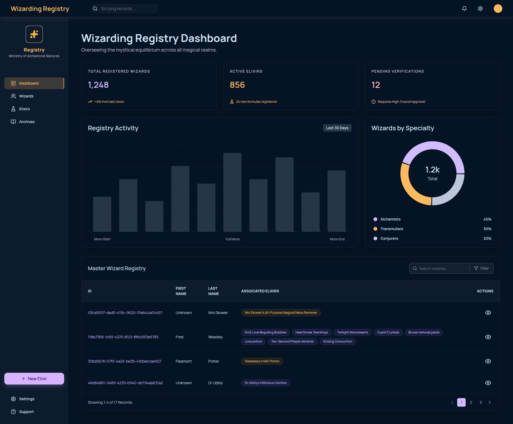

# Wizarding Registry Dashboard

A dashboard built from a Figma design.

Live Demo: https://wizards-two.vercel.app

---

## What I Built

- Dashboard layout matching the Figma design
- KPI cards with static data
- Bar chart and Pie chart using Recharts
- Wizards table fetching live data from the Wizard World API
- Null handling — shows "Unknown" when firstName or lastName is missing
- Debounced search 1s
- Client-side pagination — resets when search changes
- Skeleton loading screens
- Empty and error states in the table
- Code splitting with React lazy and Suspense
- Responsive layout — works on mobile and smaller screens
- API base URL stored in `.env`

---

## Tech Stack

- React 19 + TypeScript
- Vite
- Tailwind CSS
- Recharts
- TanStack Query
- Lucide React

---

## Caching

TanStack Query handles caching — if you search and cancel, no extra request is fired. If you type and delete quickly, it won't re-fetch either.

---

> **Note:** Each feature was developed in a separate Git branch and merged into `main` when complete — you can review the branch history on GitHub.

## Component Folder Organization

The `components` folder is split by concern:

- `dashboard/` — all dashboard sections, each in its own folder (charts, KPI cards, wizards table, wizard detail modal)
- `layouts/` — TopBar and Sidebar
- `ui/` — shared components like Pagination
- `Skeleton/` — skeleton screens for loading states

---

